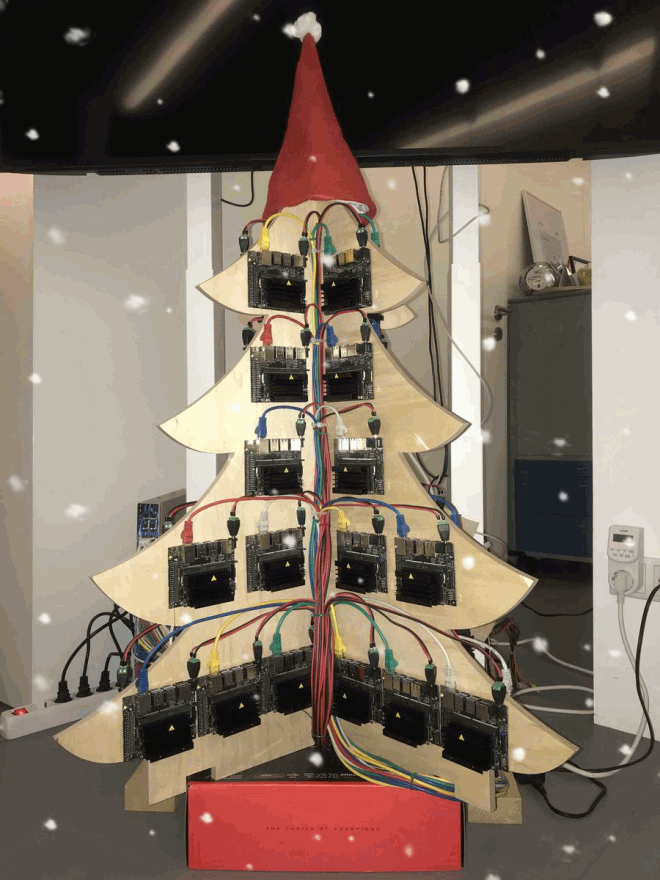
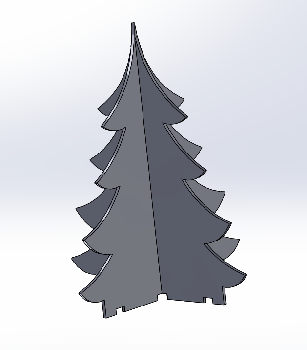
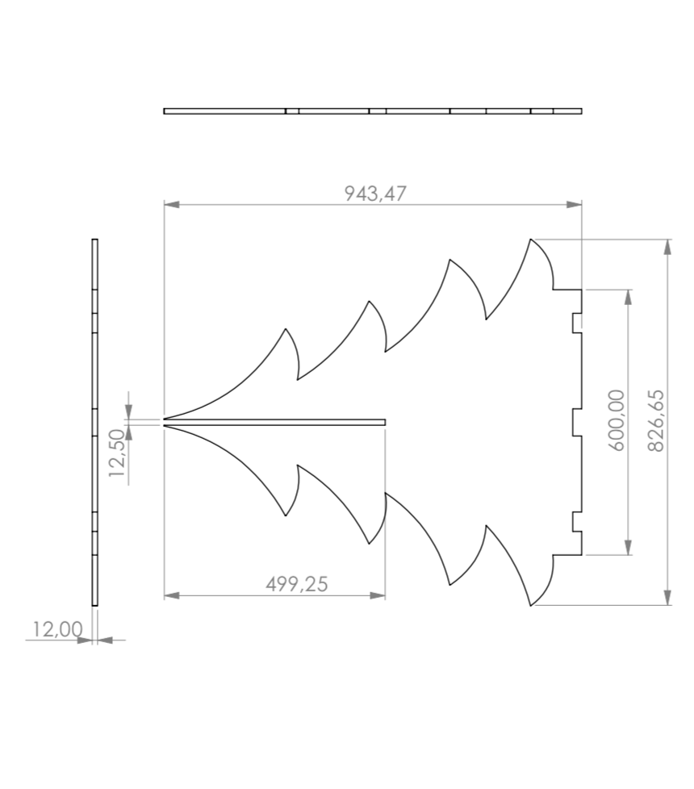
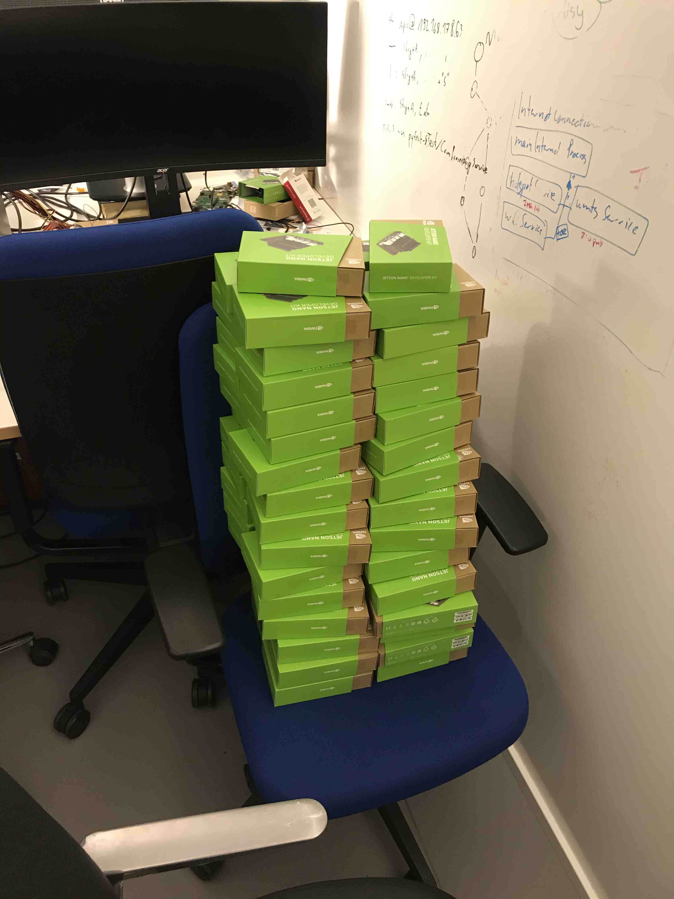
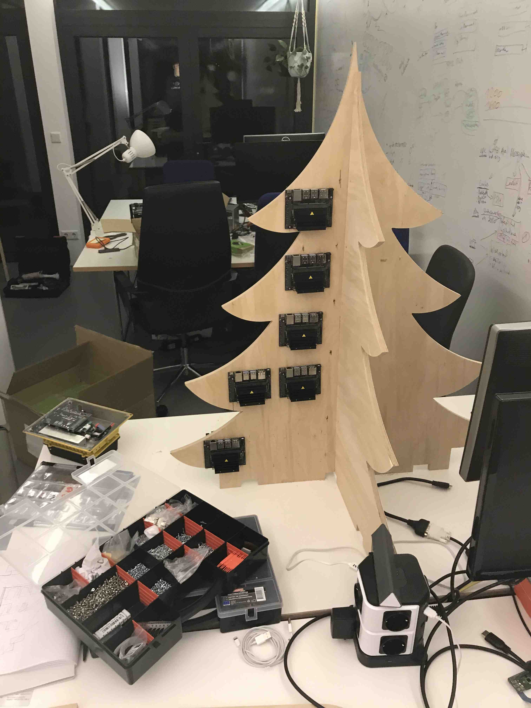
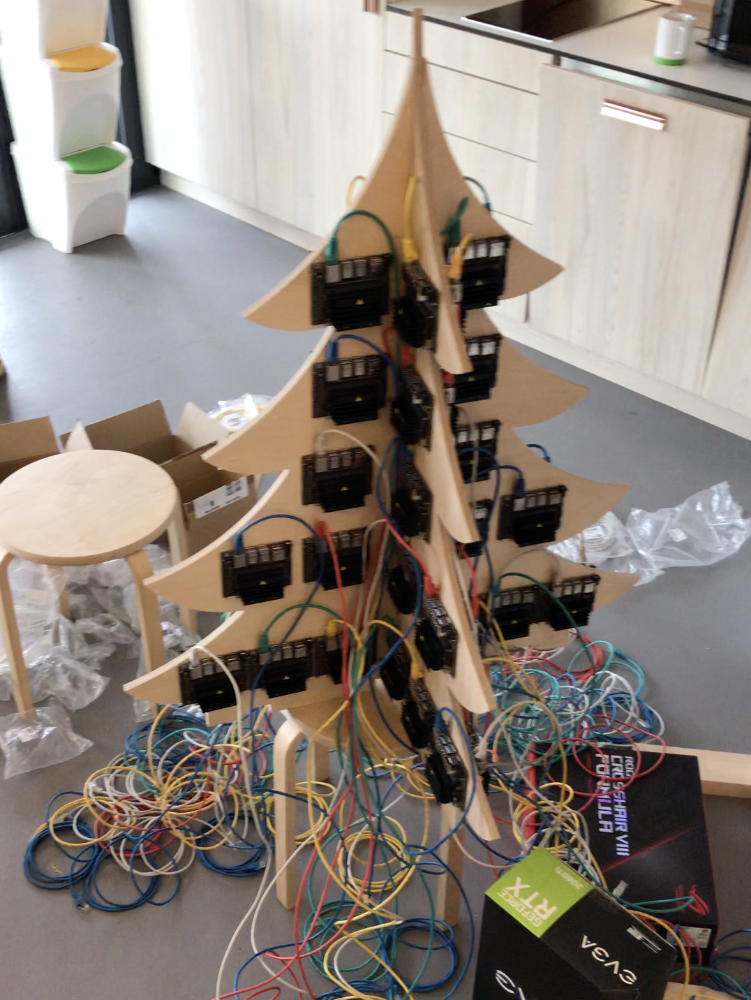
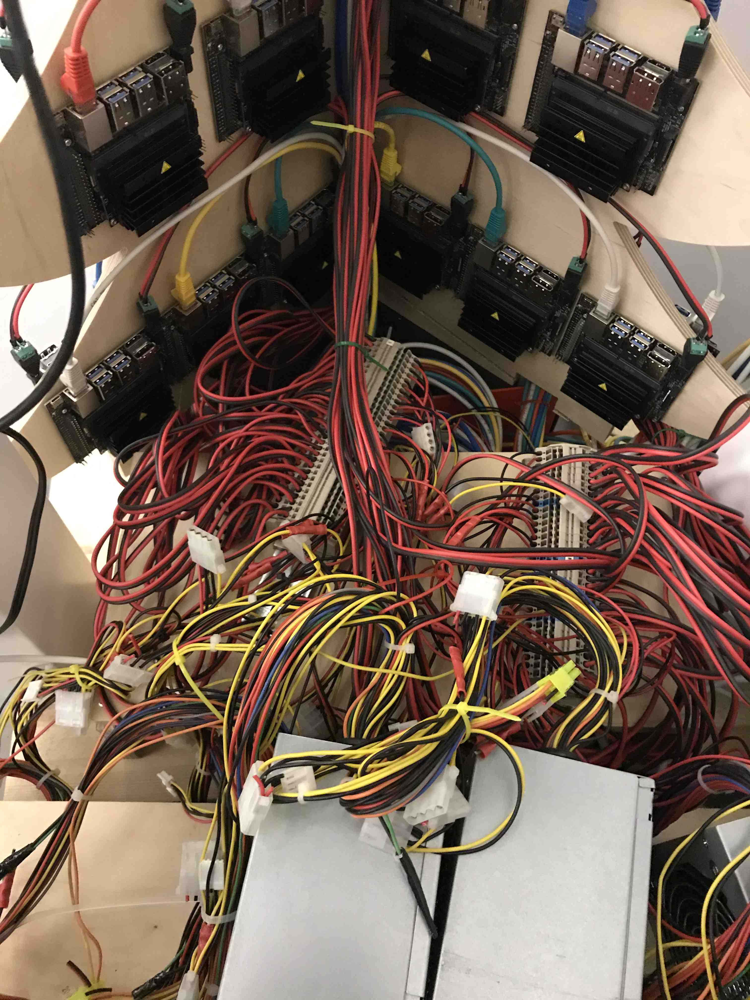
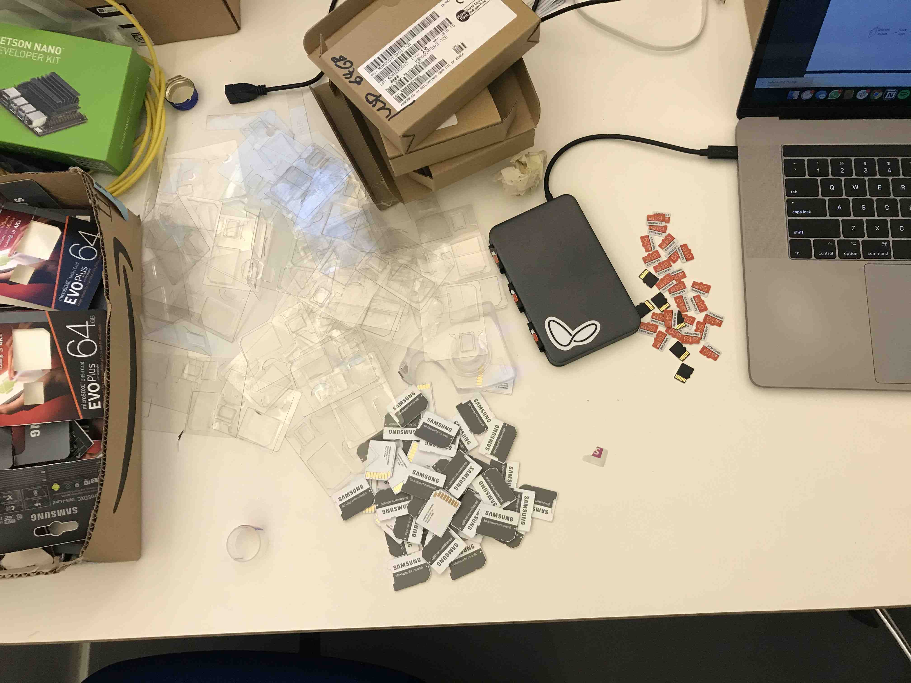

# The tale of the bee-saving christmas tree
It is the time of the year gifts are exchanged, candles are lit and fireplaces warm our hearts. In our case, Santa got in a little early and brought about **64 NVIDIA Jetson Nano dev kits**. We used them to build the Jetson tree with a total of 8.192 CUDA cores and 256 CPU cores. It’s flickering LEDs now light our office, warming both our hearts and our neighborhood. We will use its power to analyze bee videos in order to investigate the reasons behind the perishing of insects.

<p align="center">
  
</p>


## Our Motivation
At [apic.ai](https://apic.ai), we believe technology can help us create a better understanding of nature. In our case, we use it to find the reasons for the perishing of insects. We do so by analysing bee behavior like motion patterns and pollen intake. Our monitoring system visually detects bees as they enter and leave their hives. Through their level of activity, mortality and food abundance we gain insights into the well-being of the insects and the plant diversity in the environment. The information thus enables us to evaluate the regional living conditions for insects, detects problems and propose measures to improve the situation.

This winter, we are upgrading our hardware platform from the Raspberry Pi to the NVIDIA Jetson Nano. To do so, we needed a way to test our software on a large number of devices. Our **Jetson Tree** consisting of **64 NVIDIA Jetson Nanos**, will be processing multiple terabytes of video footage that we recorded at bee hives in 2019.
While being fashionably in season, it enables us to better understand the Jetson Nanos behaviour under load and resolve bugs. Thus we can have a clean start into 2020's bee season, when they become part of our monitoring systems and have to perform at remote bee hives. \
As a bonus we now have our own GPU cluster to run experiments on.

<p align="center">
  <div align="center">
    <b>Here is a short video on what we are aiming for at <a href="https://apic.ai" target="\_blank">apic.ai</a></b>
  </div>
  <div align="center">
    <a href="https://www.youtube-nocookie.com/embed/sgCGHBek1To" target="\_blank"></a>
  </div>
</p>


## How did we build it?
Even though this seems to be a simple project, it is a time-consuming build. Due to  the sheer size of the cluster it took us a week to finish.

We decided to CNC mill a wooden tree and attached 8 Jetsons to each side. To test different software stacks, we used [Open Balena](https://www.balena.io/open/) to manage the device fleet and deploy software. Since we are currently using [Mender.io](https://mender.io/) for our fleet management, this was an excellent chance to compare containerized software deployment to full image updates.

This build guide covers the following aspects:
* How to build a GPU cluster from Jetson Nanos
* How to setup Open-Balena for fleet management and software rollouts
* How to deploy custom code to the cluster

### Hardware
**What you will need to build the project:**
* **64 x** NVIDIA Jetson Nano Dev Kits
* **64 x** Micro-SD cards
* **66 x** Ethernet cables
* 48- and 24-port Gigabit Ethernet switch
* 5V PSUs with more than 128A
* Wooden Christmas tree, ours measures 1 meter
* Other small items of equipment (screws, terminal blocks, ...)

We placed a more [detailed BOM](resources/hardware/BOM.md) into the resources of this repository.

#### Building the Jetson Tree

##### Manufacturing the Wooden Tree
We milled the two 1 x 1-meter tree-shaped sided out of a sheet of wood.
If you have a CNC use the [CAD STEP files](resources/hardware/STEP_files). In case you want to use a jigsaw this project includes a [PDF](resources/hardware/assembly.PDF) of the exact measurements.

<p align="center">
  
</p>

Afterwards, we marked the positions where we wanted to place the Jetson Nanos and drilled pilot holes for the standoffs into the wood. For better cooling, we recommend rotating the Jetson Nanos by 90 degrees, so the cold air can rise from the bottom through the heatsinks.

##### Mounting the Jetson Nanos on the tree
For the mounting of each Jetson Nano, four standoffs are screwed into the pilot holes Each Jetson Nano is connected to the PSU and Ethernet switch. The cutouts on the bottom are used to run the cables to the back. Since we did not have access to a decent PSU, we used 10 ATX PSUs that provide a total of 300A at 5V (not recommended). Furthermore, we used rail terminal blocks to connect the Jetson Nanos to the PSU.
We highly recommend using many cable ties to keep everything clean!


<p align="center">
  
</p>

### Software
Our overall aim of this project is to test our software, get a better understanding of the Jetson platform and compare containerized development with our current workflow.
Therefore we decided to use Open-Balena, open-source software to manage connected IoT devices for the deployment of our code.

#### Provisioning the server

The first step is to set up the Open-Balena server that acts as a device manager. To do so, we started a Debian VM on the Google Cloud platform. We also connected a domain to the servers static IP so that the devices can reach the server. The code below describes the overall process and originates from [open-balena quickstart guide](https://github.com/balena-io/open-balena).

```bash
# Install dependencies
sudo apt-get update
sudo apt-get install -y build-essential git curl
sudo apt-get install libssl-dev nodejs -y

# Create balena user
sudo adduser balena --disabled-password
sudo usermod -aG balena

# Install docker and docker-compose
curl -sSL https://get.docker.com/ | sh
sudo usermod -aG docker balena
sudo curl -L https://github.com/docker/compose/releases/download/1.24.0/docker-compose-Linux-x86_64 -o /usr/local/bin/docker-compose
sudo chmod +x /usr/local/bin/docker-compose

# Install Open-Balena
git clone https://github.com/balena-io/open-balena.git ~/open-balena
cd ~/open-balena
./scripts/quickstart -U admin@email.com -P {secret_password} -d balena.yourdomain.com


# login with balena user
# Start server
./scripts/compose up -d

# Stop server
./scripts/compose stop
```

Make sure these domains are pointing to the server:
- `api.balena.yourdomain.com`
- `registry.balena.yourdomain.com`
- `vpn.balena.yourdomain.com`
- `s3.balena.yourdomain.com`

#### Install the balena CLI tooling locally
In order to interact with the management server you will need to install the `balena-cli` tooling locally, by adding the npm package globally.
```bash
npm install balena-cli -g --production --unsafe-perm
```

Furthermore, point balena CLI to your server by setting `balenaUrl` to the server domain (`balena.yourdomain.com`) name in the CLI configuration file. Please create this file if it does not already exist:
- Linux or macOS: `~/.balenarc.yml`
```
balenaUrl: "balena.yourdomain.com"
```

##### Share self signed certificate with clients
On startup the server creates a self signed certificate that you will have to share with your developers, so that they can push Docker images to your own registry.

- The location of the servers certificates:
`~/open-balena/config/certs/root/ca.crt`
- Add the self signed certificate to your keychain in order to enable docker to push images to the Balena registry.
```bash
#Mac OSX
export NODE_EXTRA_CA_CERTS='~/Desktop/balena-test/balena.crt'
sudo security add-trusted-cert -d -r trustRoot -k /Library/Keychains/System.keychain ~/Desktop/balena-test/balena.crt
osascript -e 'quit app "Docker"' && open -a Docker
```

##### Authenticate your Balena CLI with the server
In order to enable the Balena CLI tooling to authenticate with the server, export the **absolute certificate path** as an environment variable.
```bash
export NODE_EXTRA_CA_CERTS='/Users/{USERNAME}/Desktop/balena-test/balena.crt'
```

Use `balena login` to authenticate with your chosen credentials `admin@email.com` and `{secret_password}` with the server.

More about the Balena CLI can be found in [documentation](https://www.balena.io/docs/reference/cli/). The most important commands are `balena apps` and `balena devices` to list deployed apps and devices.

#### Provision the SD cards

We will now create a test application and configure the Balena os image to connect with our server and listen for application updates.
1. Create test application
`balena create app jetson_test_app`
2. Provision the Balena base os
    1. Download from [https://www.balena.io/os/](https://www.balena.io/os/)
    2. Configure os
    `balena os configure ~/Downloads/balena.img --application jetson_test_app`
3. Flash image to sd card and insert into the device.
    1. Flash mutliple images with [Etcher](https://www.balena.io/etcher/).
<p align="center">
  
</p>
    2. Insert SD cards into every Jetson Nano. This will take a while 🙈.
4. Wait for device to authenticate with the Open-Balena server (~30sec).
    - Use `watch balena devices` to wait until every device is online.
    - In order to list detailed information, use `balena device {device_id}`


#### Deploy your own container

We started with deploying a stress test application to the tree in order to evaluate the power consumption and heat development.
1. git clone stress test repo and deploy application
```bash
git clone git@github.com/balena-io-projects/balena-stress-test.git
cd balena-stress-test
balena deploy jetson_test_app --logs --source . --emulated
```
2. Watch logs
`balena logs {device_id}`

For dockerizing your application, we highly recommend to check out the [balena playground](https://github.com/balena-io-playground). Especially the [Jetson Nano sample app](https://github.com/balena-io-projects/jetson-nano-sample-app), since it is guiding you through the process of getting CUDA, OpenCV, and more to run on the Jetson Nano.

## Conclusion
The overall setup enables us to deploy our code to the Jetson Tree, test it for bugs and performance during the holiday season. Additionally, we can analyze a lot of the bee images recorded in 2019 during this test period and make sure the neural nets we use are performant and self-sufficient. Last but not least building the [apic.ai](https://apic.ai) Jetson Tree has been setting everyone in the right mood for the holidays and it was a lot of fun.
